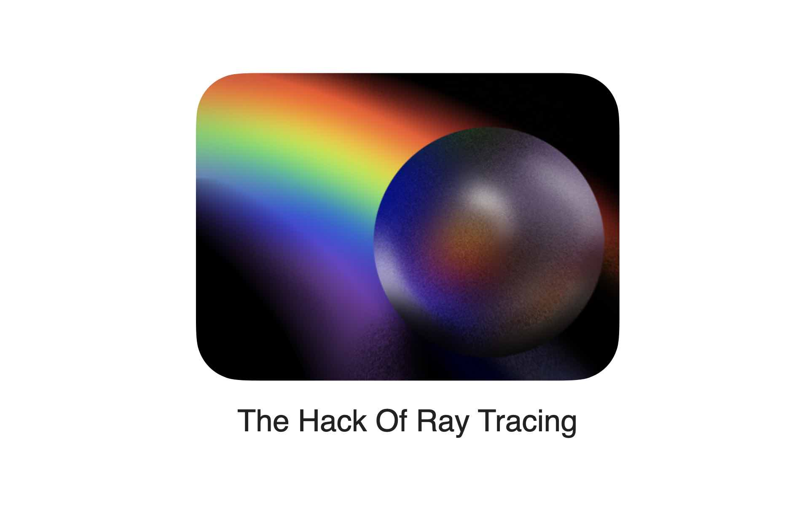

# wwdc2021
### My wwdc2021 submission The HackOf RayTracing

This is my second time participating in the swift student challenge. Last year I made a playground about visualizing four-dimensional cube. I have a keen interest in computer graphics. So this year I make a playgroundbook about Ray Tracing. I mainly use MetalKit and compute shader to make a ray tracing engine running on iPad in real time.

Ray Tracing is a huge and very challenging topic. To accelerate my application, I use MetalKit creating threads and threadgroups to control every individual pixel on screen. And I code lots of shader programs to create my own ray tracing engine. Fortunately because of the powerful performance of iPad, it can run more than 30FPS on newest Pro model. I also use UIGestureRecognizer to allow you to move the camera and soar in the ray tracing scene.

It's a ray tracing engine I built from scratch, including building path tracing algorithms, different materials, camera system, anti-aliasing, and even a pseudo-random number table. Interestingly, I used random numbers and some filtering algorithms to create a scene of the Milky Way, which you can see on the last page. In short, many 3D mathematics and radiometric algorithms are used in the shaders.

I not only built a ray tracing system for readers to experience, I hope readers can also understand the hack of it. So I use SpriteKit and SceneKit to visualize the mathematical process like how ray finding the point of intersection. The visualization process is all interactive.

